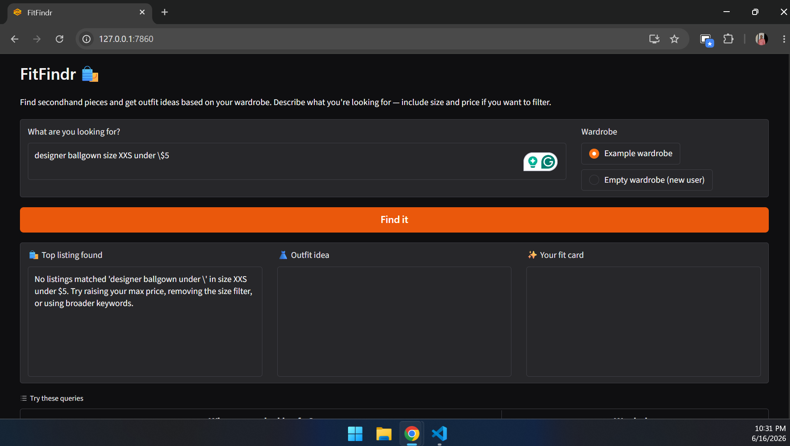

# FitFindr 🛍️

FitFindr is an AI agent that helps you shop secondhand fashion. You describe what
you're looking for in plain language, and the agent finds matching listings,
styles the top find against your wardrobe, and writes a shareable "fit card"
caption — all in one interaction.

---

## What It Does

Give FitFindr a natural-language request like *"vintage graphic tee under $30"*
and it runs a three-tool workflow:

1. **Finds** matching secondhand listings within your filters
2. **Styles** the top item against pieces you already own
3. **Writes** a casual, post-ready caption for the look

If nothing matches your search, it stops early and tells you exactly how to
adjust your query instead of guessing.

---

## Project Structure

```
ai201-project2-fitfindr-starter/
├── data/
│   ├── listings.json          # Mock secondhand listings
│   └── wardrobe_schema.json   # Wardrobe format + example wardrobe
├── utils/
│   └── data_loader.py         # Helper functions for loading the data
├── tests/
│   └── test_tools.py          # Failure-mode + happy-path tests
├── tools.py                   # The three required tools
├── agent.py                   # Planning loop + state management
├── app.py                     # Gradio interface
├── conftest.py                # Lets `pytest tests/` find the modules
├── planning.md                # Design spec (written before coding)
└── requirements.txt           # Python dependencies
```

---

## Setup & Running

```bash
# 1. Create and activate a virtual environment
python -m venv .venv
source .venv/Scripts/activate      # Windows (Git Bash)
# source .venv/bin/activate        # macOS / Linux

2. Install dependencies
pip install -r requirements.txt

3. Add your Groq API key to a .env file in the project root
(get a free key at https://console.groq.com)
echo "GROQ_API_KEY=your_key_here" > .env

4. Launch the app
python app.py ```


Then open the local URL printed in your terminal (usually `http://localhost:7860`, but check the terminal — the port may differ).

**Run the tests:**
```bash
pytest tests/
```
---


## Tool Inventory

Tool Inventory
FitFindr uses three tools, all defined in tools.py.

Tool # 1: search_listings
Inputs:  description (str), size (str | None), max_price (float | None)
Returns: list[dict] — listings sorted by relevance, each with id, title, description, category, style_tags, size, condition, price, colors, brand, platform. Empty list if nothing matches.
Purpose: Filters the listings dataset by price and size, then scores remaining items by keyword overlap with the description.


Tool # 2: suggest_outfit
Inputs: new_item (dict), wardrobe (dict)
Returns: str — 1–2 outfit suggestions
Purpose: Calls the LLM to pair the found item with named pieces from the user's wardrobe (or gives general styling advice if the wardrobe is empty).

Tool # 3: create_fit_card
Inputs: outfit (str), new_item (dict)
Returns: str — a 2–4 sentence caption
Purpose: Calls the LLM (high temperature) to write a casual, shareable OOTD caption mentioning the item, price, and platform.

---

## Planning Loop


The loop lives in run_agent() in agent.py and is a conditional sequence. It does not call all three tools unconditionally.

1. Initialize a session dict to hold all state.
2. Parse the query with regex into description, size, and max_price. (Regex was chosen over an LLM parser for speed and determinism.)
3. Search, then branch on the result:
        * If search_listings returns [] → set session["error"] to a specific, actionable message and return early. The outfit and fit-card tools are never called. This is the agent's adaptive decision point.
        * If results exist → select the top-ranked item and continue.
4. Suggest an outfit for the selected item.
5. Create a fit card from that outfit.
6. Return the session.

The loop terminates either early (no results) or after the fit card is built.

---


## State Management

A single session dict (created by _new_session()) is the source of truth for one interaction. It carries data between tools so the user never re-enters anything:

__________________________________________________________________________________________
     Field	       |       Set when	           |         Used by                          |
___________________|___________________________|__________________________________________|
query, parsed	   |  At start / after parsing |	   search_listings
search_results	   |  After search	           |    Branch decision
selected_item	   |  Top result chosen	       |    suggest_outfit and create_fit_card
outfit_suggestion  |	 After styling	       |    create_fit_card
fit_card	       |  After caption	           |    Final output
error	           |  On early exit	           |    Tells the caller the run ended early

The same selected_item flows from search_listings → suggest_outfit → create_fit_card automatically, and the outfit_suggestion passes straight into create_fit_card. No re-entry needed by the user.


## Error Handling:

Each tool has a defined failure mode and response:

Tool # 1: search_listings
Failure Mode: No listings match.
Agent Response: The loop detects the empty list, sets an actionable error message, and stops before calling the other tools.


Tool # 2: suggest_outfit
Failure Mode: Wardrobe is empty.
Agent Response: Returns general styling advice for the item instead of crashing.


Tool # 3: create_fit_card
Failure Mode: Outfit string is empty/whitespace.
Agent Response: Returns a descriptive error string ("Can't create a fit card without an outfit suggestion…") instead of raising.

Concrete example from testing: Searching designer ballgown size XXS under $5 returns no matches. The agent responds:
"No listings matched 'designer ballgown' in size XXS under $5. Try raising your max price, removing the size filter, or using broader keywords."
The outfit and fit-card panels stay empty — the agent does not fabricate a result.





## Spec Reflection

How the spec helped: Writing planning.md before any code meant the session dict fields, tool signatures, and error branches were decided up front. When I fed those exact sections to the AI tool to generate the planning loop, the output matched my design immediately because the spec was unambiguous.

One divergence: My original planning.md walkthrough predicted lst_006 (the bootleg tee) would rank first for "vintage graphic tee." In practice, lst_002 (the Y2K baby tee) tied on keyword score and ranked first due to stable sort order. I updated the walkthrough to match the actual behavior rather than force the code to match the spec.


## AI Usage Transparency

Instance 1 — search_listings scoring: I gave the AI my first Tool spec and the search_listings docstring. I then asked it to implement the keyword-overlap scoring and filtering.
* What I reviewed/revised: When I tested the example query, two tees tied on score. I verified this was correct stable-sort behavior, confirmed lst_002 was the real top result, and updated my planning.md walkthrough to match instead of changing the code.

Instance 2 — regex query parser:  I asked the AI to implement the regex parser that extracts description, size, and max_price from a natural-language query.
* What I reviewed/revised: Its first version searched the original query for a size token, so the "30" in "$30" was wrongly parsed as size "30," breaking the search. I overrode it to run size detection on the price-stripped text instead, which fixed the bug.